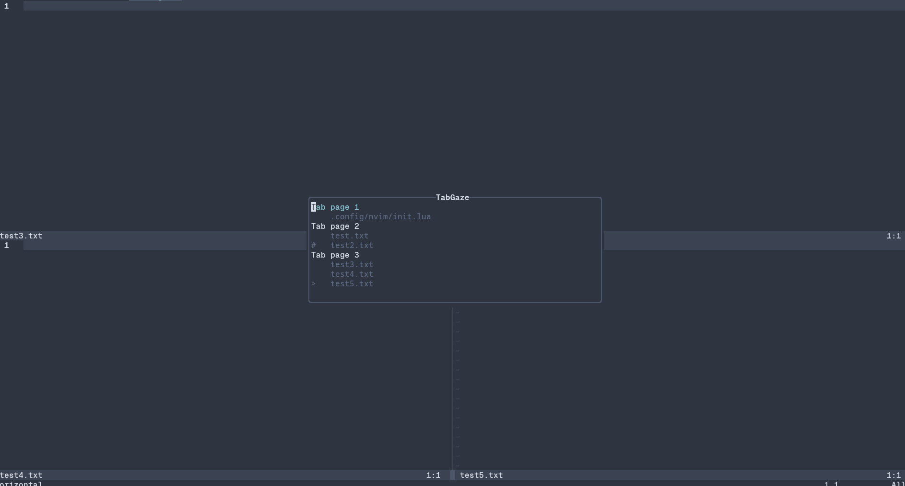

# TabGaze



- a simple plugin to get an overview of your currently open tab pages
- quickly switch to a tabpage without risking wrist injuries
- (basically harpoon for tabs)

## Installing

### Lazy.nvim

an example config for lazy.nvim would look like this

```lua
{
    "butteronarchbtw/tabgaze.nvim",
    config = function()
        require("tabgaze").setup()
        vim.keymap.set("n", "<leader>tp", ":Tabgaze<CR>", {silent = true})
    end
}
```

## Credit

i still have no idea of how to develop nvim plugins so a lot of inspo for figuring it out myself comes from these repos

- [https://github.com/ThePrimeagen/harpoon](https://github.com/ThePrimeagen/harpoon) because you know what the name is
- [https://github.com/tamton-aquib/duck.nvim](https://github.com/tamton-aquib/duck.nvim) for figuring out what a even a small nvim plugin needs to get up and running
- [https://github.com/nvim-lua/plenary.nvim](https://github.com/nvim-lua/plenary.nvim) for figuring out how UI in nvim works

## TODOs
- [ ] shortcuts for jumping to tabs directly
- [ ] option to start at the top of the list or at the tab you are at when opening the view
